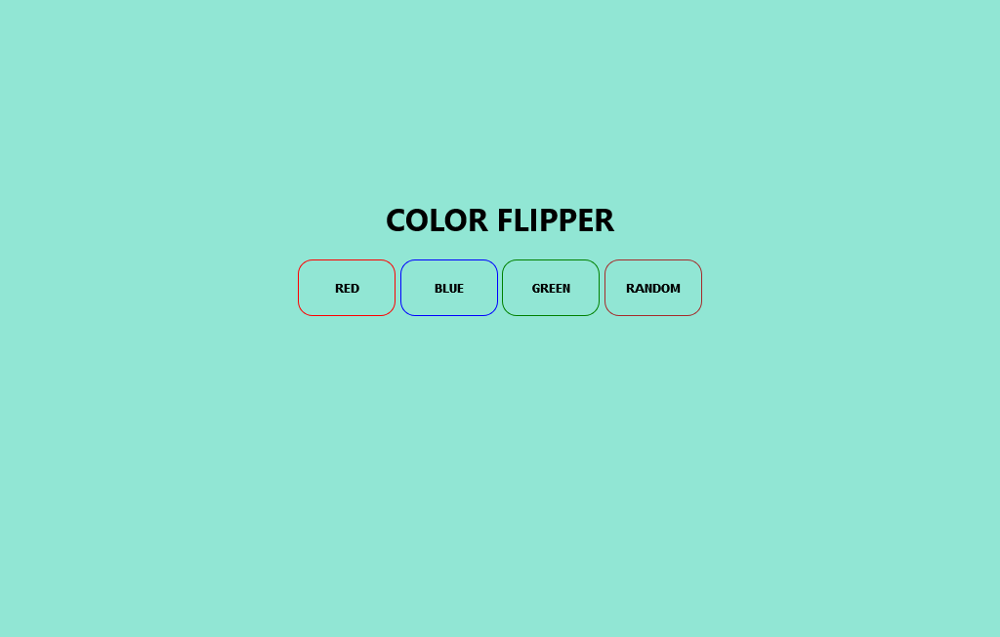

Color_Flipper

This project includes JavaScript functions to change the background color of the webpage and the border color of specific elements. The colors can be set either to a specific color or a randomly generated color.

Features
Set Background Color: Change the background color of the webpage to a specified color.
Set Element Border Color: Change the border color of an element identified by a specific ID.
Random Background Color: Generate and apply a random background color to the webpage.
Functions
bgcolor(name)
Changes the background color of the body and sets the border color of an element with the given ID.

Parameters:

name (string): The color to set as the background and the ID of the element to change the border color.

bgcolor('blue'); // Sets the background to blue and the border color of the element with ID 'blue' to white

random()
Generates a random color and sets it as the background color of the body.
random(); // Sets the background to a randomly generated color

How to Use
1. Include the JavaScript code in your HTML file.
2. Ensure you have elements with the corresponding IDs if you want to change their border color using the bgcolor function.
3. Call the bgcolor(name) function with the desired color and element ID.
4. Call the random() function to set a random background color.



```
<!DOCTYPE html>
<html lang="en">
<head>
    <meta charset="UTF-8">
    <meta name="viewport" content="width=device-width, initial-scale=1.0">
    <title>Background Color Changer</title>
</head>
<body>
    <button id="blue" onclick="bgcolor('blue')">Blue Background</button>
    <button onclick="random()">Random Background</button>

    <script src="script.js"></script>
</body>
</html>

// JavaScript code as provided in the initial instructions
const body = document.getElementsByTagName("body")[0];

function bgcolor(name) {
    body.style.backgroundColor = name;
    const element = document.getElementById(name);
    if (element) {
        element.style.borderColor = "#fff";
        console.log(name);
    }
}

function random() {
    const red = Math.round(Math.random() * 255);
    const blue = Math.round(Math.random() * 255);
    const green = Math.round(Math.random() * 255);
    const color = `rgb(${red}, ${blue}, ${green})`;
    body.style.backgroundColor = color;
}
```

